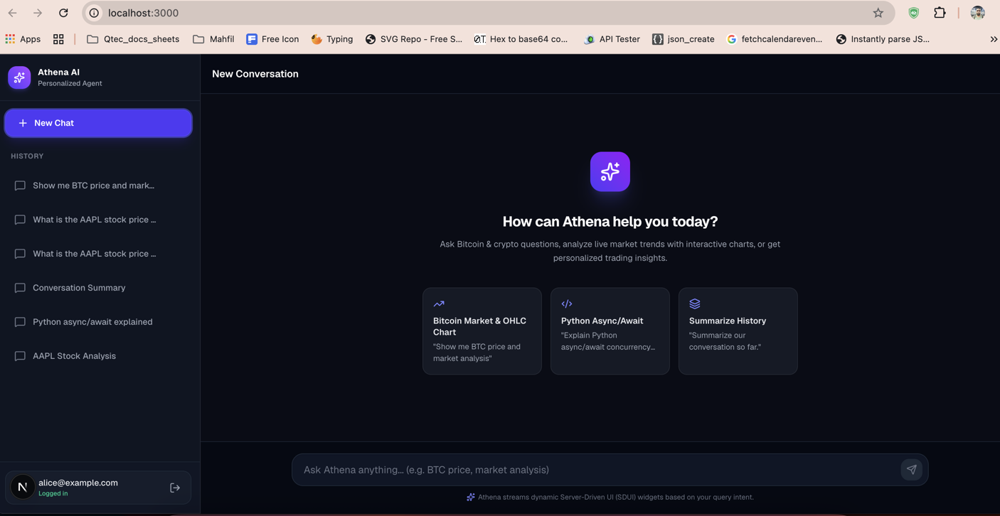
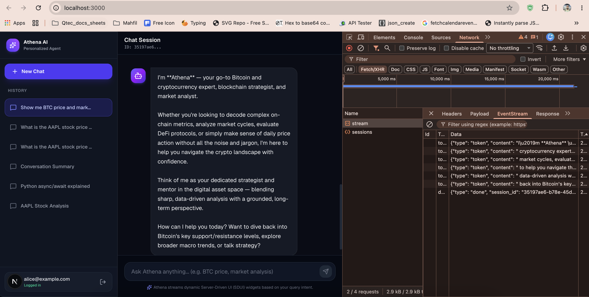
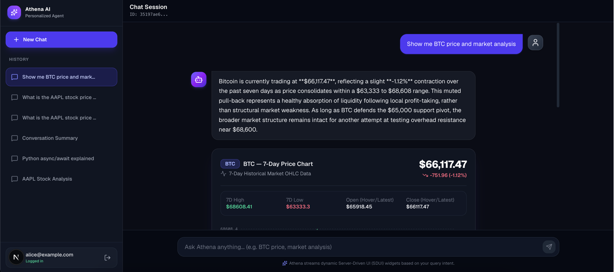

# 🤖 Personalized AI Agent (Athena AI)

> **A Full-Stack AI System powered by FastAPI, LangGraph, Google Gemini (can use ANY LLM), PostgreSQL, and Next.js 14 with Server-Driven UI (SDUI) Streaming.**

---

## 🌟 Overview

**Personalized AI Agent (Athena AI)** is an enterprise-grade, full-stack artificial intelligence application. It features a **stateful agentic core** built on **LangGraph** and **FastAPI**, communicating with a modern **Next.js 14 (App Router)** client via **Server-Sent Events (SSE)**.

The system pioneers a **Server-Driven UI (SDUI)** approach: the AI backend determines query intent, executes domain logic, and dynamically streams both text tokens and rich interactive UI components (such as **Interactive Candlestick Charts**, **Metric Cards**, and **Data Tables**) directly into the chat interface without hardcoded frontend component logic.

---

## 🖼️ Application Showcase & Screenshots

<div align="center">

### 1. **Athena AI Assistant & Real-Time Chat Interface**

*Interactive chat window featuring multi-turn conversation memory, stream status indicators, and prompt recommendations.*

<br/>

### 2. **Server-Driven UI (SDUI) — Interactive Market Charts & Analytics**

*Dynamic SDUI widget rendering interactive 7-Day OHLC Candlestick Charts, live market volume, and trend indicators emitted directly by the LangGraph backend.*

<br/>

### 3. **Authentication & Session History Management**

*JWT-authenticated user dashboard with persistent thread history, session switching, and single-click chat deletion.*

</div>

---

## 🔥 Key Technical Highlights

- 🧠 **LangGraph Stateful Agent Architecture**: Uses a multi-node Directed Acyclic Graph (DAG) with an **LLM Decision Router**, **API Action Nodes**, **Summarization Nodes**, and **General Response Nodes**.
- 🎨 **Server-Driven UI (SDUI)**: Backend streams structured `widget_json` payloads via SSE events (`token`, `widget`, `done`, `error`). The Next.js client renders dynamic React widgets (`CandlestickChart`, `MetricCard`, `DataTable`) based on backend intent.
- 💾 **Stateful Memory Persistence**: Uses LangGraph's `PostgresSaver` checkpointer to preserve conversation state across server restarts using thread IDs.
- ⚡ **Real-Time SSE Streaming**: Async token streaming powered by FastAPI `StreamingResponse` and custom SSE line-by-line `TextDecoder` readers on the frontend.
- 🔐 **JWT Auth & Security**: User authentication with `bcrypt` password hashing and `Bearer` token middleware protection across all protected API routes.
- 🐳 **Dockerized Infrastructure**: Single-command orchestrator managing PostgreSQL 16, FastAPI backend, auto DDL table creation, and seeders.
- 📁 **Feature-First Architecture**: Strictly modular codebase adhering to SOLID principles and Clean Architecture separation of concerns on both backend (`app/`) and frontend (`src/features/`).

---

## 🏗️ System Architecture & Workflow

```
┌──────────────────────────────────────────────────────────────────────────────┐
│                         PERSONALIZED AI AGENT                                │
├────────────────────────────┬─────────────────────────────────────────────────┤
│     FRONTEND (Next.js)     │          BACKEND (FastAPI + LangGraph)          │
│                            │                                                 │
│  ┌──────────────────────┐  │  ┌─────────────┐     ┌──────────────────────┐   │
│  │  Chat Page (RSC)     │  │  │  FastAPI    │     │    LangGraph Agent   │   │
│  │  ├─ ChatWindow       │  │  │  ┌────────┐ │     │                      │   │
│  │  │   ├─ MessageList  │◄─┼──┼─►│  SSE   │◄├─────┤  ┌──────────────┐    │   │
│  │  │   └─ InputBar     │  │  │  │ /chat  │ │     │  │ LLM Decision │    │   │
│  │  └─ SessionSidebar   │  │  │  │/stream │ │     │  │   (Gemini)   │    │   │
│  │                      │  │  │  └────────┘ │     │  └──────┬───────┘    │   │
│  │  ┌──────────────────┐│  │  │  ┌────────┐ │     │         │ route      │   │
│  │  │ WidgetRenderer   ││  │  │  │  Auth  │ │     │  ┌──────▼───────┐    │   │
│  │  │ (SDUI Engine)    ││  │  │  │  JWT   │ │     │  │ api_call /   │    │   │
│  │  │  ├─ CandleChart  ││  │  │  └────────┘ │     │  │ summary /    │    │   │
│  │  │  ├─ DataTable    ││  │  └─────────────┘     │  │ general node │    │   │
│  │  │  └─ MetricCard   ││  │         │            │  └──────────────┘    │   │
│  │  └──────────────────┘│  │  ┌──────▼──────┐     └──────────────────────┘   │
│  └──────────────────────┘  │  │  PostgreSQL  │                                │
│                            │  │  (Docker)    │                                │
│   EventSource / Stream     │  │ LangGraph    │                                │
│   + ReadableStream Reader  │  │ Checkpointer │                                │
└────────────────────────────┴──┴──────────────┴────────────────────────────────┘
```

---

## 🛠️ Tech Stack

| Layer | Technologies & Tools |
|---|---|
| **Backend Framework** | FastAPI (Python 3.12+), Uvicorn, Pydantic v2 |
| **AI & Agentic Framework** | LangGraph, LangChain, Google Gemini (`gemini-1.5-flash`) |
| **Database & Persistence** | PostgreSQL 16 (Dockerized), `asyncpg`, `psycopg3`, `PostgresSaver` |
| **Authentication** | JWT (`python-jose`), `bcrypt` password hashing |
| **Streaming Protocol** | Server-Sent Events (SSE) via `text/event-stream` |
| **Frontend Framework** | Next.js 14 (App Router), TypeScript, React 18 |
| **Styling & Icons** | Tailwind CSS v4, Lucide React, Glassmorphism UI tokens |
| **DevOps & Tooling** | Docker, Docker Compose, Makefile, Bash script (`setup.sh`) |

---

## 🚀 Quick Start & Installation Guide

### 1. Prerequisites
Ensure you have the following installed on your machine:
- [Docker & Docker Compose](https://www.docker.com/)
- [Node.js 18+](https://nodejs.org/)
- Make CLI utility

---

### 2. Environment Setup
Run the interactive environment setup command:
```bash
make setup
```
This automatically copies `.env.example` templates to `backend/.env` and `frontend/.env.local`.

Edit `backend/.env` and insert your **Google Gemini API Key**:
```env
GOOGLE_API_KEY=your_actual_google_gemini_api_key
SECRET_KEY=generate_a_secure_32_character_secret_key
```
> 💡 *Need a free Gemini key? Get one in seconds at [Google AI Studio](https://aistudio.google.com/app/apikey).*

---

### 3. Run full Application (`make dev`)
To launch the entire full-stack application (FastAPI, PostgreSQL container, and Next.js frontend) with a single command:
```bash
make dev
```

The application will be accessible at:
- 🌐 **Web Client**: [http://localhost:3000](http://localhost:3000)
- ⚙️ **Backend API**: [http://localhost:8000](http://localhost:8000)
- 📖 **Interactive Swagger Docs**: [http://localhost:8000/docs](http://localhost:8000/docs)

---

### 4. Seed Database with Test Data (`make seed`)
To populate PostgreSQL with out-of-the-box test users, chat threads, and financial SDUI widget messages:
```bash
make seed
```

**Pre-seeded Test Credentials**:
| Email | Password | Role |
|---|---|---|
| `alice@example.com` | `Password123!` | Primary Test User |
| `bob@example.com` | `Password123!` | Secondary Test User |

---

## 📋 Makefile Commands Reference

| Command | Action |
|---|---|
| `make dev` | Start complete stack (Docker Backend + Next.js Frontend) |
| `make backend` | Start Docker backend services only (FastAPI + PostgreSQL) |
| `make frontend` | Start Next.js development server only |
| `make setup` | Initialize environment files (`.env`) |
| `make seed` | Populate PostgreSQL with dummy users & chat history |
| `make stop` | Stop all running Docker containers |
| `make logs` | Tail real-time logs from Docker containers |
| `make clean` | Remove Docker containers and volumes (Full Reset) |

---

## 📡 API Reference

### 🔐 Auth Endpoints
- `POST /api/auth/register` — Register a new account (returns JWT token).
- `POST /api/auth/login` — Authenticate existing credentials (returns JWT token).
- `GET /api/auth/me` — Retrieve profile of authenticated caller.

### 💬 Chat & Streaming Endpoints
- `POST /api/chat/stream` — **SSE Streaming Endpoint** (requires `Bearer <token>`). Emits real-time SSE events:
  - `event: token` — Text chunk emitted as the LLM generates.
  - `event: widget` — Structured SDUI payload for dynamic React rendering.
  - `event: done` — Signals stream completion with final `session_id`.

### 📂 Session History Endpoints
- `GET /api/sessions` — List all chat sessions for authenticated user.
- `GET /api/sessions/{session_id}/messages` — Fetch message history for thread.
- `DELETE /api/sessions/{session_id}` — Hard-delete a conversation thread and its messages.

---

## 📂 Folder Structure (Feature-First Architecture)

```
personalized-ai-agent/
├── Makefile
├── setup.sh
├── docker-compose.yml
├── screenshorts/                   # Application screenshots
│   ├── image_1.png
│   ├── image_2.png
│   └── image_3.png
│
├── backend/                        # FastAPI + LangGraph Backend
│   ├── Dockerfile
│   ├── requirements.txt
│   ├── seeder.py                   # Standalone DB seeder
│   └── app/
│       ├── main.py                 # FastAPI setup & lifespan
│       ├── config.py               # Pydantic settings & CORS
│       ├── database.py             # asyncpg + PostgresSaver pools
│       ├── agent/
│       │   ├── state.py            # AgentState TypedDict
│       │   ├── graph.py            # LangGraph StateGraph builder
│       │   ├── prompts.py          # Athena AI prompt engineering
│       │   └── nodes/              # Graph execution nodes
│       ├── api/                    # API Route Handlers
│       ├── core/                   # JWT Auth & utility functions
│       └── schemas/                # Pydantic Request/Response models
│
└── frontend/                       # Next.js 14 Frontend
    ├── package.json
    ├── next.config.ts
    └── src/
        ├── app/                    # App Router Pages & Layouts
        ├── features/
        │   ├── auth/               # Login & Auth Context
        │   ├── sessions/           # Sidebar & Chat Threads
        │   ├── chat/               # SSE Chat Window & Message List
        │   └── widgets/            # SDUI Engine & Component Registry
        └── shared/                 # Reusable UI Primitives & Utilities
```

---

## 📄 License

Distributed under the MIT License. See `LICENSE` for more information.

---

<div align="center">

**Developed with ❤️ by [Fozle Rabbi](https://fozlerabbi321.github.io)**

</div>
